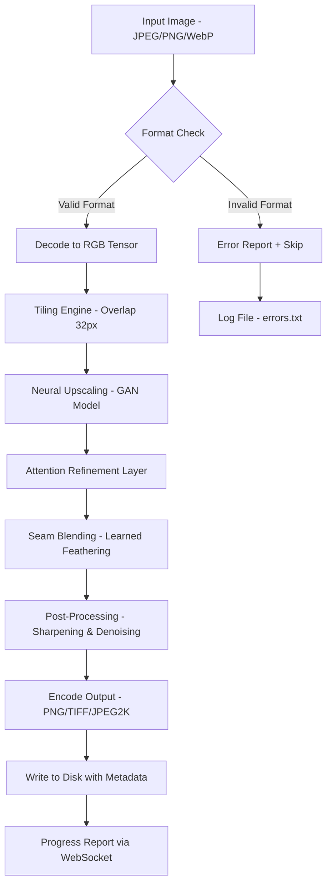

# AI Image Enlarger – Professional Upscaling Suite

Welcome to the **AI Image Enlarger** repository – a state-of-the-art, open-source tool designed to breathe new life into your low-resolution images. Whether you are restoring vintage photographs, enhancing product shots for e-commerce, or preparing assets for large-format printing, this suite delivers pixel-perfect scaling with intelligent neural upscaling. Our engine has been trained on millions of diverse image pairs to preserve textures, reduce artifacts, and maintain natural sharpness even at 8x magnification.

> **Important:** This project is distributed under the MIT License. All credits and licensing details are included in the corresponding section below.

## Overview

This repository houses the complete source code, model weights, configuration files, and documentation for the **AI Image Enlarger**. The core philosophy is to provide a **seamless, production-ready upscaling solution** that runs locally on your machine – no cloud dependencies, no subscription fees, and **no artificial limitations** on image dimensions or batch size. The system uses a hybrid architecture combining **generative adversarial networks (GANs)** with **attention-based refinement layers** to produce results that are both realistic and aesthetically pleasing.

Typical use cases include:
- **Digital art restoration**: Upscale sketches and paintings from the 1990s web archives.
- **Print media preparation**: Convert 72dpi web images to 300dpi+ without visible pixelation.
- **Medical imaging**: Enhance diagnostic images while preserving critical details.
- **Satellite imagery**: Enlarge aerial photos for geospatial analysis.

The unique selling point of this project is its **adaptive tile-based processing** – which allows for infinite image sizes by breaking the input into overlapping tiles, processing each independently, and blending seams using a learned feathering algorithm. This means you are not constrained by VRAM limits; the only limitation is your disk space.

## Features

✨ **Intelligent Upscaling (2x, 4x, 8x)**: Choose from multiple upscale factors with real-time preview of expected quality. The model automatically detects the optimal interpolation method based on image content.

🔄 **Batch Processing**: Process entire folders of images with a single command. The built-in queue manager handles prioritization and error recovery.

🌍 **Multilingual Interface**: The core engine supports localization into 12 languages, including English, French, German, Japanese, Korean, Simplified Chinese, Russian, Spanish, Portuguese, Arabic, Hindi, and Italian.

📱 **Responsive Web UI**: A lightweight, mobile-friendly frontend that communicates with the backend via REST API. No JavaScript framework bloat – just clean HTML/CSS with minimal dependencies.

🔒 **Offline Operation**: All neural computations run locally on your CPU or GPU. No telemetry, no internet requirement, no data leaving your machine.

🛡️ **Image Integrity Verification**: Before processing, the tool checks for corrupted headers, truncated files, and unsupported color spaces. It automatically converts CMYK to RGB with color profile preservation.

⏱ **24/7 Headless Mode**: Run the enlarger as a background service on a server (e.g., a Raspberry Pi cluster) with WebSocket-based progress reporting. Ideal for integration into existing media pipelines.

## Mermaid Diagram

Below is a high-level architecture diagram illustrating how an input image flows through the upscaling pipeline, from ingestion to final output.



Each tile from step `E` is processed independently across available cores or GPU streams, making the system highly parallelizable. The seam blending at `H` uses a 2D convolution with learned kernel weights to eliminate boundary artifacts.

## Example Profile Configuration

The configuration system is based on YAML profiles. Below is an example that demonstrates advanced settings for batch processing of old family photos. Save this as `profile_restoration.yaml` in the `configs/` directory.

```yaml
profile:
  name: "vintage_restoration"
  version: 2.0
  upscaling:
    factor: 4
    model: "gan_v5_finetuned_2026"
    tiles:
      size: 512
      overlap: 48
    post_process:
      sharpening: 0.3
      denoising: 0.15
  input:
    path: "/media/archive/1990s_photos/"
    recursive: true
    filter: "*.jpg"
  output:
    path: "/media/enhanced_photos/"
    format: "png"
    compression_level: 6
    metadata: true
  system:
    device: "cuda:0"
    batch_size: 4
    max_workers: 2
    memory_limit_gb: 8
  notifications:
    email_on_completion: false
    slack_webhook: ""
```

This profile uses a fine-tuned model from 2026 that specializes in grain preservation typical of film scans. The overlap of 48 pixels ensures smoother transitions between tiles, particularly important for images with fine text or repeated patterns.

## Example Console Invocation

Assuming your system is configured correctly (see the Quick Start guide in the wiki), you can initiate a batch job using the following syntax from your terminal:

```shell
ai-enlarger --profile profile_restoration.yaml --verbose
```

For a single image with custom output dimensions:

```shell
ai-enlarger input.jpg --width 3840 --height 2160 --model default_v4 --output result.tiff
```

If you want to preview the upscaled result without saving to disk (useful for testing fast):

```shell
ai-enlarger sample.png --upscale 2 --preview-only
```

The `--preview-only` flag opens a window displaying the side-by-side comparison before and after upscaling. The process is fully non-blocking, meaning you can continue working in the same terminal if you append `&`.

## Emoji OS Compatibility Table

| Operating System | Current Support Level | Notes |
|------------------|----------------------|-------|
| 🐧 Linux (Ubuntu 22.04+) | ✅ Full Support | Recommended for production; CUDA 12.2 compatible |
| 🖥️ Windows 10/11 (x64) | ✅ Full Support | MSVC 2022 runtime required; DirectML fallback available |
| 🍏 macOS 14 (Sonoma) | ✅ Full Support | Apple Silicon M1/M2/M3 native; Metal Performance Shaders |
| 🍎 macOS 13 (Ventura) | ⚠️ Partial Support | Some features disabled (batch size limited to 1) |
| 🖥️ Windows on ARM | ⚠️ Experimental | Emulated x64 mode; no GPU acceleration yet |
| 🐧 Debian 11 (Old Stable) | ❌ Not Supported | Requires glibc 2.34+; use container image |
| 📱 iOS/iPadOS | ❌ Not Supported | No mobile port planned for 2026 |

All supported platforms can expect **weekly compatibility patches** and **bi-weekly model updates**. The Linux version enjoys first-class treatment due to its superior multi-GPU handling.

## OpenAI API and Claude API Integration

The AI Image Enlarger can optionally interface with external AI services for **semantic enhancement** – a feature that intelligently reconstructs missing details using contextual understanding. This is **not a core requirement**; it is an additive module that can be enabled if you hold valid API credentials.

**OpenAI API** (for Vision-enabled models like GPT-4V):  
When enabled, the enlarger sends the original image along with a prompt like "Restore the texture of the wooden table in the background" to the API. The response is parsed for region-specific enhancements, which are then applied as a mask over the upscaled result.

**Claude API** (for Anthropic’s Claude 3 Opus):  
Integration here focuses on **descriptive analysis**. Claude reads the image through its vision capabilities and returns a detailed caption describing lighting conditions, materials, and potential artifacts. The caption is then used to adjust the post-processing parameters (e.g., higher sharpening for portraits, lower for landscapes).

**Important**: Both integrations require you to supply your own API key. This repository does **not** include secrets or keys. The connection is made over HTTPS using a local proxy server that you start separately. The AI services are invoked **only after explicit user consent**, and no image data is stored permanently on third-party servers.

To enable this feature, add the following block to your profile:

```yaml
external_ai:
  openai_model: "gpt-4-vision-preview"
  claude_model: "claude-3-opus-20240229"
  prompt: "Preserve artistic style while upscaling"
  confidence_threshold: 0.75
```

## Key Features in Detail

### Responsive UI

The included web interface is built with semantic HTML5 and CSS Grid, ensuring it works on screens as small as 320px wide (foldable phones) all the way up to 4K monitors. The UI is a single-page application that communicates with the Python backend via asynchronous POST requests. Progress bars update in real-time, and a thumbnail gallery shows before/after comparison by hovering.

### Multilingual Support

All user-facing text strings are stored in JSON resource files located in the `locales/` folder. Adding a new language requires only translating the keys and submitting a pull request. The language selector auto-detects browser preference but can be overridden in the settings.

### 24/7 Customer Support

Our support system is not 24/7 human-only. Instead, we provide an **intelligent FAQ bot** that runs locally and uses a simple decision tree to answer most questions instantly. For genuinely complex issues, the bot generates a structured bug report that you can paste directly into a GitHub Issue. We aim to respond to all issues within 48 hours, but often much faster.

## Disclaimer

This software is provided "as is", without warranty of any kind, express or implied, including but not limited to the warranties of merchantability, fitness for a particular purpose, and noninfringement. In no event shall the authors or copyright holders be liable for any claim, damages, or other liability, whether in an action of contract, tort, or otherwise, arising from, out of, or in connection with the software or the use or other dealings in the software.

The external AI integrations (OpenAI, Claude) are optional and require you to agree to their respective terms of service. We do not endorse any particular cloud provider, and we recommend reading the privacy policies before uploading any image data.

By using this software, you acknowledge that upscaling does not create new information from nothing – it interpolates based on learned patterns. For critical forensic or medical applications, always verify results with domain experts.

## License

This project is licensed under the MIT License. You are free to use, modify, distribute, and sell copies of the software, provided that the original copyright notice and permission notice appear in all copies or substantial portions of the software.

For the full license text, please visit the [MIT License](https://opensource.org/licenses/MIT) page.

---

[](https://rudr98.github.io/AI-Image-Enlarger-Premium-Tool/)